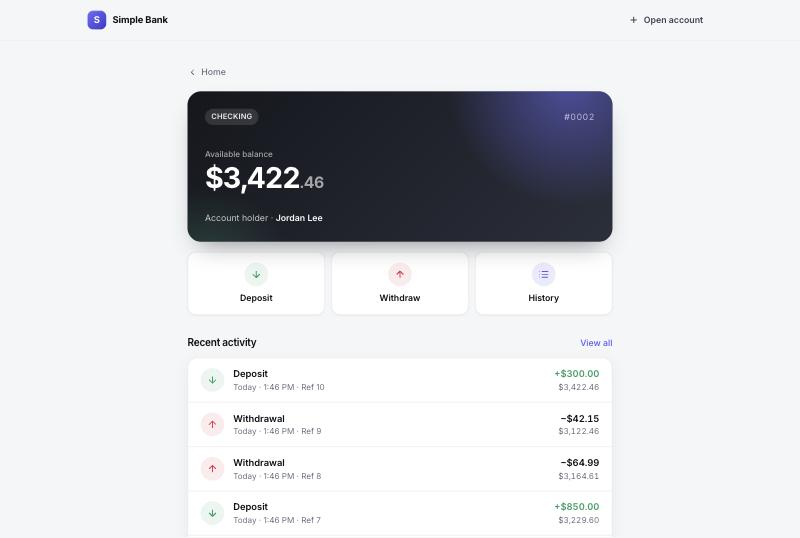
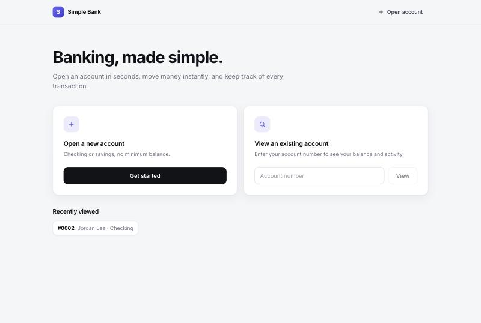
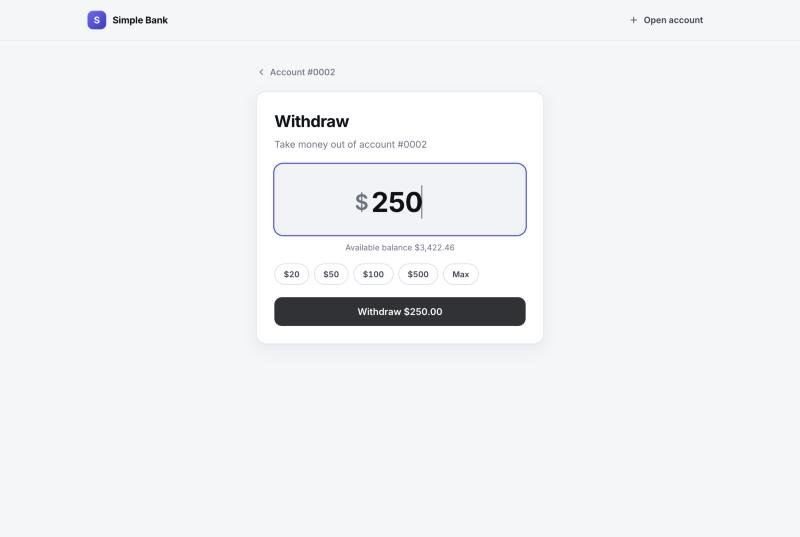
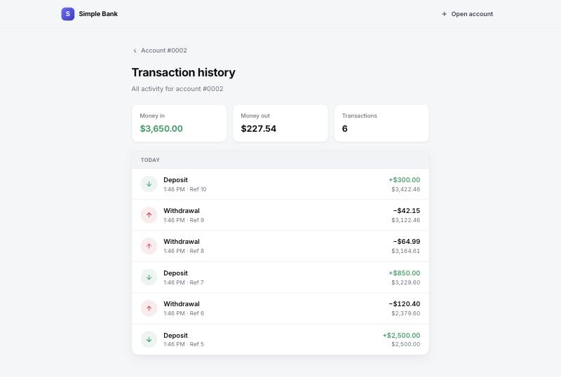
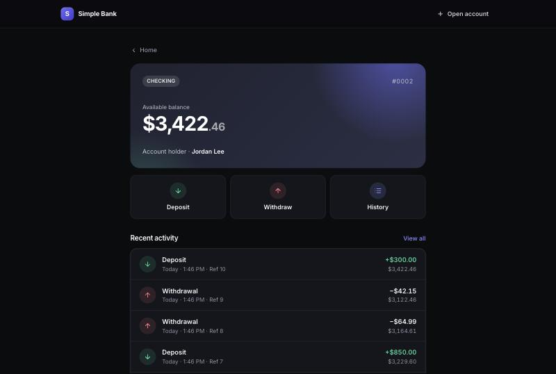
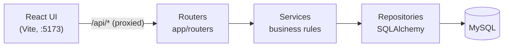
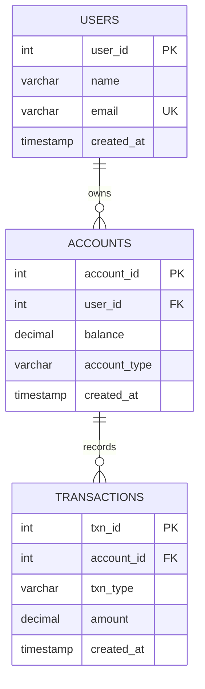

<div align="center">

# 🏦 Simple Bank

**A full-stack banking app: FastAPI + MySQL on the back, React on the front.**

Open accounts, deposit and withdraw money, and browse transaction history, built step by step with a clean layered architecture.




</div>

---

## Contents

- [Features](#features)
- [Screenshots](#screenshots)
- [Architecture](#architecture)
- [Quick start](#quick-start)
- [API reference](#api-reference)
- [Business rules](#business-rules)
- [Testing](#testing)
- [Project structure](#project-structure)
- [Tutorial branches](#tutorial-branches)
- [Troubleshooting](#troubleshooting)
- [Roadmap](#roadmap)

## Features

- 👤 **Users & accounts**: create a customer and open checking or savings accounts
- 💸 **Deposits & withdrawals**: validated amounts, and no overdrafts
- 🧾 **Transaction history**: every movement recorded, newest first, with running balance in the UI
- 🔒 **Safe under concurrency**: row-level locking (`SELECT … FOR UPDATE`) and a single commit per operation
- 📖 **Interactive docs**: Swagger UI at `/docs`, plus a ready-made Postman collection
- 🎨 **Polished UI**: responsive React frontend with light/dark mode
- ✅ **Tested**: pytest suite that runs on in-memory SQLite, no database server required

## Screenshots

| Home | Withdraw |
|---|---|
|  |  |
| **Transaction history** | **Dark mode** |
|  |  |

## Architecture



| Layer | Responsibility | Location |
|---|---|---|
| **Router** | HTTP: parse and validate requests, shape responses | [`app/routers/`](app/routers) |
| **Service** | Business rules: positive amounts, no overdrafts, atomic updates | [`app/services/`](app/services) |
| **Repository** | Data access, the only layer that talks to the ORM | [`app/repositories/`](app/repositories) |
| **Model** | SQLAlchemy entities: `User`, `Account`, `Transaction` | [`app/models.py`](app/models.py) |
| **Schema** | Pydantic request/response DTOs (camelCase JSON) | [`app/schemas.py`](app/schemas.py) |

Dependencies are wired per request in [`app/dependencies.py`](app/dependencies.py). All repositories in one request share a single database session, so a service can stage several changes and commit them together.

### Data model



## Quick start

### Prerequisites

- **Python 3.10+**
- **Node.js 18+** (for the frontend)
- **MySQL 8**. Optional for a first run: see [Try it without MySQL](#try-it-without-mysql).

### 1. Backend

```bash
# from the project root
python3 -m venv .venv
source .venv/bin/activate          # Windows: .venv\Scripts\activate
pip install -r requirements.txt
```

Create the database and point the app at it:

```sql
CREATE DATABASE bankdb;
```

```bash
cp .env.example .env
# then edit .env:
# DATABASE_URL=mysql+pymysql://<user>:<password>@localhost:3306/bankdb
```

Start the API. Tables are created automatically on startup; [`sql/schema.sql`](sql/schema.sql) is there if you'd rather create them by hand.

```bash
uvicorn app.main:app --reload
```

- API → http://localhost:8000
- Swagger UI → http://localhost:8000/docs
- ReDoc → http://localhost:8000/redoc

### 2. Frontend

In a second terminal:

```bash
cd frontend
npm install
npm run dev
```

Open **http://localhost:5173**. The dev server proxies `/api/*` to the backend on port 8000. See the [frontend README](frontend/README.md) for details.

### Try it without MySQL

SQLAlchemy can run the whole app on SQLite, which is handy for a quick look:

```bash
DATABASE_URL=sqlite:///./bank.db uvicorn app.main:app --reload
```

## API reference

Base URL: `http://localhost:8000`. All request and response bodies are JSON, with camelCase keys.

| Method | Endpoint | Description | Success |
|---|---|---|---|
| `GET` | `/` | Health check | `200` |
| `POST` | `/api/users` | Create a user (returns the existing user if the email is taken) | `201` / `200` |
| `GET` | `/api/users/{userId}` | Get a user | `200` |
| `POST` | `/api/accounts` | Open an account | `201` |
| `GET` | `/api/accounts/{accountId}` | Get an account and its balance | `200` |
| `POST` | `/api/accounts/{accountId}/deposit` | Deposit money | `200` |
| `POST` | `/api/accounts/{accountId}/withdraw` | Withdraw money | `200` |
| `GET` | `/api/accounts/{accountId}/transactions` | Transaction history, newest first | `200` |

<details>
<summary><b>Example requests and responses</b></summary>

**Create a user**

```http
POST /api/users
{ "name": "Jordan Lee", "email": "jordan@example.com" }
```
```json
{ "userId": 1, "name": "Jordan Lee", "email": "jordan@example.com", "createdAt": "2026-09-29T17:46:27" }
```

**Open an account** (`accountType` is `checking` or `savings`, case-insensitive)

```http
POST /api/accounts
{ "userId": 1, "accountType": "checking" }
```
```json
{ "accountId": 1, "userId": 1, "balance": "0.00", "accountType": "checking", "createdAt": "2026-09-29T17:46:27" }
```

**Deposit / withdraw** (amount must be > 0 with at most 2 decimal places)

```http
POST /api/accounts/1/deposit
{ "amount": 500 }
```
```json
{ "accountId": 1, "userId": 1, "balance": "500.00", "accountType": "checking", "createdAt": "2026-09-29T17:46:27" }
```

**Transaction history**

```http
GET /api/accounts/1/transactions
```
```json
[
  { "txnId": 2, "accountId": 1, "txnType": "withdrawal", "amount": "120.40", "createdAt": "2026-09-29T17:48:02" },
  { "txnId": 1, "accountId": 1, "txnType": "deposit", "amount": "500.00", "createdAt": "2026-09-29T17:47:10" }
]
```

> Money is serialized as a string (`"500.00"`) so no precision is lost to floating point.

</details>

### Errors

Every error has the same shape:

```json
{ "detail": "Insufficient funds: balance is 500.00, requested 900" }
```

| Status | When |
|---|---|
| `400` | Validation failed (bad email, unknown account type, amount ≤ 0 or > 2 decimals), or insufficient funds |
| `404` | User or account not found |
| `409` | Conflicts with existing data (e.g. two simultaneous sign-ups with the same email) |

### Try it from the terminal

```bash
curl -X POST localhost:8000/api/users -H 'Content-Type: application/json' -d '{"name":"Jordan Lee","email":"jordan@example.com"}'
curl -X POST localhost:8000/api/accounts -H 'Content-Type: application/json' -d '{"userId":1,"accountType":"checking"}'
curl -X POST localhost:8000/api/accounts/1/deposit -H 'Content-Type: application/json' -d '{"amount":500}'
curl -X POST localhost:8000/api/accounts/1/withdraw -H 'Content-Type: application/json' -d '{"amount":120.40}'
curl localhost:8000/api/accounts/1/transactions
```

Or import [`postman_collection.json`](postman_collection.json) into Postman.

## Business rules

Enforced in [`AccountService`](app/services/account_service.py):

1. **Deposits and withdrawals must be positive**, with at most two decimal places.
2. **You can't withdraw more than the balance.** A rejected withdrawal changes nothing.
3. **Every deposit and withdrawal is recorded** as a transaction.
4. **Balance and transaction record are saved together** in one commit, so it's never one without the other.
5. **Concurrent operations can't overdraw.** The account row is locked (`SELECT … FOR UPDATE`) for the duration of the operation.

## Testing

```bash
pip install -r requirements-dev.txt
pytest
```

The suite ([`tests/`](tests)) swaps the MySQL session for an in-memory SQLite database, so it runs anywhere in well under a second. It covers every endpoint, validation, the business rules above, error formats, and the JSON contract the frontend depends on.

> SQLite ignores `FOR UPDATE`, so row locking itself is only exercised against a real MySQL database.

## Project structure

```
.
├── app/
│   ├── main.py              # FastAPI app, CORS, lifespan (creates tables)
│   ├── database.py          # engine, session factory, get_db dependency
│   ├── models.py            # SQLAlchemy models
│   ├── schemas.py           # Pydantic request/response models
│   ├── exceptions.py        # domain errors → JSON error responses
│   ├── dependencies.py      # repository / service wiring
│   ├── repositories/        # data access layer
│   ├── services/            # business logic layer
│   └── routers/             # /api/users, /api/accounts
├── frontend/                # React + Vite app (see frontend/README.md)
├── tests/                   # pytest suite (in-memory SQLite)
├── sql/schema.sql           # MySQL schema, if you prefer to create tables manually
├── docs/screenshots/        # images used in this README
├── postman_collection.json  # all endpoints, ready to import
├── requirements.txt         # runtime dependencies
├── requirements-dev.txt     # + pytest, httpx
└── .env.example             # DATABASE_URL template
```

## Tutorial branches

The project is built up one layer at a time. Check out a branch to see the code at that stage:

| Branch | What it adds |
|---|---|
| `step-1-project-setup` | Bare FastAPI app with health check and CORS |
| `step-2-database-models` | SQLAlchemy models and MySQL schema |
| `step-3-repositories` | Data access layer |
| `step-4-services` | Business logic layer |
| `step-5-rest-api` | Routers, dependency injection, Postman collection |
| `step-6-frontend` | React frontend, bug fixes, tests and UI redesign |
| `main` | The finished app (same as `step-6-frontend`) |

```bash
git checkout step-3-repositories
```

> The bug fixes, tests and redesign were added in step 6, so earlier branches don't include them.

## Troubleshooting

| Problem | Fix |
|---|---|
| Backend exits with `Can't connect to MySQL server` | Start MySQL and check `DATABASE_URL` in `.env`, or [use SQLite](#try-it-without-mysql) |
| UI says *"Can't reach the server"* | Make sure the backend is running on port 8000 |
| Backend is on a different port | `API_URL=http://localhost:8001 npm run dev` |
| `Could not open requirements file` | Run commands from the project root, not `frontend/` |
| `ModuleNotFoundError` | Activate the virtualenv: `source .venv/bin/activate` |

## Roadmap

- [ ] Login and authentication (JWT), with users only seeing their own accounts
- [ ] Transfers between accounts
- [ ] Paginated transaction history
- [ ] Alembic migrations instead of `create_all`
- [ ] Docker Compose for MySQL + API + frontend
